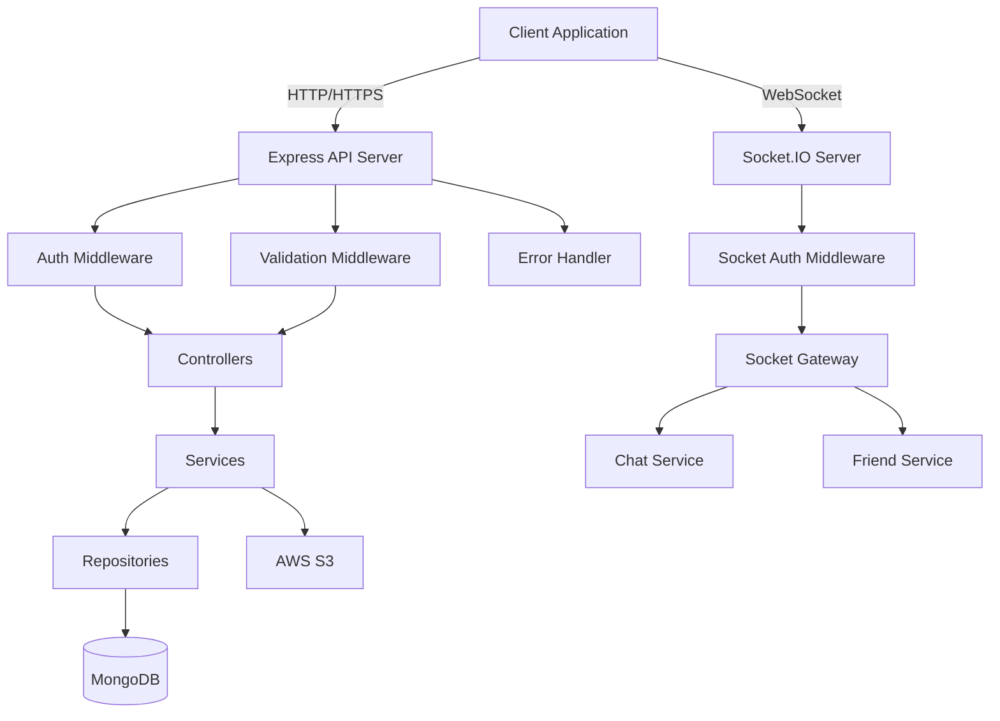

# Social Media Application - Design Document

## Overview

This design document outlines the architecture and implementation details for a full-featured social media application built with Node.js, Express, MongoDB, Socket.IO, and AWS S3. The application follows a modular, layered architecture with clear separation of concerns, implementing industry best practices for security, scalability, and maintainability.

The system is organized into distinct modules (User, Post, Chat, Friend) with each module containing its own routes, controllers, services, repositories, models, and validation schemas. Cross-cutting concerns like authentication, error handling, and file storage are implemented as shared utilities and middleware.

## Architecture

### High-Level Architecture



### Directory Structure

```
src/
├── config/
│   ├── database.config.ts
│   ├── s3.config.ts
│   └── socket.config.ts
├── middleware/
│   ├── error.middleware.ts
│   ├── auth.middleware.ts
│   ├── validation.middleware.ts
│   └── upload.middleware.ts
├── utils/
│   ├── hash.util.ts
│   ├── jwt.util.ts
│   ├── email.util.ts
│   ├── otp.util.ts
│   └── exception.class.ts
├── modules/
│   ├── user/
│   │   ├── user.model.ts
│   │   ├── user.repository.ts
│   │   ├── user.service.ts
│   │   ├── user.controller.ts
│   │   ├── user.validation.ts
│   │   └── user.routes.ts
│   ├── post/
│   │   ├── post.model.ts
│   │   ├── post.repository.ts
│   │   ├── post.service.ts
│   │   ├── post.controller.ts
│   │   ├── post.validation.ts
│   │   └── post.routes.ts
│   ├── comment/
│   │   ├── comment.model.ts
│   │   ├── comment.repository.ts
│   │   ├── comment.service.ts
│   │   ├── comment.controller.ts
│   │   ├── comment.validation.ts
│   │   └── comment.routes.ts
│   ├── friend/
│   │   ├── friend.model.ts
│   │   ├── friend.repository.ts
│   │   ├── friend.service.ts
│   │   ├── friend.controller.ts
│   │   ├── friend.validation.ts
│   │   └── friend.routes.ts
│   └── chat/
│       ├── chat.model.ts
│       ├── message.model.ts
│       ├── chat.repository.ts
│       ├── chat.service.ts
│       ├── chat.controller.ts
│       ├── chat.validation.ts
│       └── chat.routes.ts
├── socket/
│   ├── socket.gateway.ts
│   ├── socket.middleware.ts
│   ├── socket.events.ts
│   └── connected-sockets.map.ts
├── storage/
│   ├── storage.service.ts
│   └── storage.types.ts
├── shared/
│   ├── base.repository.ts
│   ├── types/
│   │   ├── request.types.ts
│   │   └── response.types.ts
│   └── constants/
│       ├── roles.ts
│       └── status-codes.ts
├── app.ts
└── server.ts
```

## Components and Interfaces

### 1. Error Handling System

**Custom Exception Class:**
```typescript
class AppException extends Error {
  constructor(
    public statusCode: number,
    public message: string,
    public isOperational: boolean = true
  ) {
    super(message);
  }
}
```

**Global Error Middleware:**
- Catches all errors passed via `next(error)`
- Determines if error is operational or programming error
- Formats consistent error responses with status code and message
- Logs errors for debugging
- Handles Zod validation errors specifically

### 2. Database Layer

**Connection Management:**
- Establishes MongoDB connection on startup
- Implements retry logic for connection failures
- Exports connection instance for use across application

**Base Repository Pattern:**
```typescript
abstract class BaseRepository<T> {
  constructor(protected model: Model<T>) {}
  
  async findOne(filter: FilterQuery<T>): Promise<T | null>
  async create(data: Partial<T>): Promise<T>
  async update(id: string, data: Partial<T>): Promise<T | null>
  async delete(id: string): Promise<boolean>
  async find(filter: FilterQuery<T>, options?: QueryOptions): Promise<T[]>
}
```

**Concrete Repositories:**
- UserRepository extends BaseRepository
- PostRepository extends BaseRepository
- ChatRepository extends BaseRepository
- Implements module-specific query methods

### 3. User Module

**User Model:**
```typescript
interface IUser {
  email: string;
  password: string;
  username: string;
  profilePicture?: string;
  isEmailConfirmed: boolean;
  otp?: string;
  otpExpiry?: Date;
  role: 'user' | 'admin';
  signatureLevel: number;
  tokens: string[];  // Active JWT tokens
  createdAt: Date;
  updatedAt: Date;
}
```

**Mongoose Hooks:**
- Pre-save: Hash password if modified using bcrypt
- Pre-save: Validate email format
- Pre-updateOne: Hash password if being updated
- Post-save: Remove sensitive fields from response

**User Service Methods:**
- `signup(data)`: Create user, generate OTP, send verification email
- `confirmEmail(email, otp)`: Verify OTP and activate account
- `login(email, password)`: Validate credentials, generate JWT
- `logout(userId, token)`: Revoke specific token
- `getUserProfile(userId)`: Retrieve user details

### 4. Authentication & Authorization

**JWT Structure:**
```typescript
interface JWTPayload {
  userId: string;
  email: string;
  role: string;
  signatureLevel: number;
  iat: number;
  exp: number;
}
```

**Auth Middleware:**
- Extracts JWT from Authorization header
- Verifies token signature and expiration
- Decodes payload and attaches to request object
- Checks if token is in user's active tokens list

**Authorization Middleware:**
- Checks user role against required roles
- Validates signature level for sensitive operations
- Returns 403 if insufficient permissions

**Extended Request Type:**
```typescript
interface IRequest extends Request {
  user?: {
    userId: string;
    email: string;
    role: string;
    signatureLevel: number;
  };
}
```

### 5. Validation System

**Zod Validation Middleware:**
```typescript
const validate = (schema: ZodSchema) => {
  return async (req: Request, res: Response, next: NextFunction) => {
    try {
      await schema.parseAsync(req.body);
      next();
    } catch (error) {
      next(new AppException(400, formatZodError(error)));
    }
  };
};
```

**General Field Schemas:**
```typescript
const generalFields = {
  email: z.string().email(),
  password: z.string().min(8).regex(/[A-Z]/).regex(/[0-9]/),
  username: z.string().min(3).max(30),
  objectId: z.string().regex(/^[0-9a-fA-F]{24}$/)
};
```

**Module-Specific Schemas:**
- User validation: signup, login, update profile
- Post validation: create post, update post
- Comment validation: create comment
- Chat validation: send message, create group

### 6. AWS S3 Storage

**S3 Configuration:**
- Initialize S3Client with credentials from environment
- Configure bucket name and region
- Set up IAM user with appropriate permissions

**Storage Service Methods:**
```typescript
class StorageService {
  async uploadFile(file: Buffer, key: string, contentType: string): Promise<string>
  async uploadLargeFile(file: Buffer, key: string): Promise<string>  // Multipart
  async generatePresignedUrl(key: string, operation: 'read' | 'write'): Promise<string>
  async deleteFile(key: string): Promise<void>
  async deleteFiles(keys: string[]): Promise<void>
  async getFileStream(key: string): Readable
}
```

**Multer Configuration:**
- Use memory storage for temporary file handling
- Validate file types (images, videos)
- Set file size limits (5MB for regular, 50MB for large files)
- Store files in memory as Buffer for S3 upload

**File Upload Flow:**
1. Client uploads file via multipart/form-data
2. Multer intercepts and stores in memory
3. Validation middleware checks file type and size
4. Controller passes file to StorageService
5. StorageService uploads to S3 with unique key
6. S3 key stored in database with associated record

### 7. Post Module

**Post Model:**
```typescript
interface IPost {
  userId: ObjectId;
  content: string;
  assets: string[];  // S3 keys
  assetFolderId: string;
  likes: ObjectId[];
  likesCount: number;
  commentsCount: number;
  visibility: 'public' | 'friends' | 'private';
  createdAt: Date;
  updatedAt: Date;
}
```

**Post Service Methods:**
- `createPost(userId, data, files)`: Create post with media uploads
- `getPosts(userId, page, limit)`: Retrieve paginated posts with availability check
- `likeUnlikePost(userId, postId)`: Toggle like status
- `deletePost(userId, postId)`: Remove post and associated assets

**Mongoose Hooks:**
- Pre-save: Generate assetFolderId for organizing S3 files
- Post-deleteOne: Delete all associated assets from S3
- Post-deleteOne: Delete all associated comments

### 8. Comment Module

**Comment Model:**
```typescript
interface IComment {
  postId: ObjectId;
  userId: ObjectId;
  content: string;
  createdAt: Date;
  updatedAt: Date;
}
```

**Comment Routes:**
- Uses Express mergeParams to access postId from parent route
- Nested under post routes: `/posts/:postId/comments`

**Comment Service Methods:**
- `createComment(userId, postId, content)`: Add comment and increment post count
- `getComments(postId, page, limit)`: Retrieve paginated comments
- `deleteComment(userId, commentId)`: Remove comment and decrement post count

### 9. Socket.IO Real-Time System

**Socket Gateway Architecture:**
```typescript
class SocketGateway {
  private io: Server;
  private connectedSockets: Map<string, Set<string>>;  // userId -> Set of socketIds
  
  initialize(httpServer: HttpServer): void
  setupMiddleware(): void
  setupEventHandlers(): void
  emitToUser(userId: string, event: string, data: any): void
  emitToRoom(room: string, event: string, data: any): void
  broadcastToRoom(room: string, event: string, data: any, excludeSocketId: string): void
}
```

**Socket Authentication Middleware:**
- Extracts JWT from handshake auth or query parameters
- Verifies token before allowing connection
- Attaches user data to socket object
- Rejects connection if authentication fails

**Connected Sockets Map:**
- Tracks all active socket connections per user
- Supports multiple tabs/devices per user
- Updates on connect/disconnect events
- Used for targeted message delivery

**Socket Events:**
```typescript
enum SocketEvents {
  // Connection
  CONNECT = 'connect',
  DISCONNECT = 'disconnect',
  
  // Friend requests
  FRIEND_REQUEST_SENT = 'friend:request:sent',
  FRIEND_REQUEST_RECEIVED = 'friend:request:received',
  FRIEND_REQUEST_ACCEPTED = 'friend:request:accepted',
  
  // Chat
  MESSAGE_SENT = 'chat:message:sent',
  MESSAGE_RECEIVED = 'chat:message:received',
  TYPING_START = 'chat:typing:start',
  TYPING_STOP = 'chat:typing:stop',
  
  // Group chat
  GROUP_CREATED = 'group:created',
  GROUP_MESSAGE = 'group:message',
  USER_JOINED_GROUP = 'group:user:joined',
  
  // Notifications
  NOTIFICATION = 'notification'
}
```

**Namespaces:**
- Default namespace `/` for general events
- `/chat` namespace for messaging
- `/notifications` namespace for system notifications

**Rooms:**
- Each group chat has a dedicated room
- Users auto-join their group rooms on connection
- Room-based broadcasting for group messages

**Acknowledgements (ACK):**
- Used for critical events requiring confirmation
- Client sends ACK callback with message delivery
- Server retries if ACK not received within timeout

### 10. Friend Module

**Friend Model:**
```typescript
interface IFriendRequest {
  senderId: ObjectId;
  receiverId: ObjectId;
  status: 'pending' | 'accepted' | 'rejected';
  createdAt: Date;
  updatedAt: Date;
}
```

**Friend Service Methods:**
- `sendFriendRequest(senderId, receiverId)`: Create request, emit socket event
- `acceptFriendRequest(requestId, userId)`: Update status, create connections, notify
- `rejectFriendRequest(requestId, userId)`: Update status to rejected
- `getFriends(userId)`: Retrieve all accepted friend connections
- `getPendingRequests(userId)`: Get incoming pending requests

**Socket Integration:**
- Emit `FRIEND_REQUEST_RECEIVED` to recipient on send
- Emit `FRIEND_REQUEST_ACCEPTED` to both users on accept
- Support multi-tab by emitting to all user sockets

### 11. Chat Module

**Chat Model:**
```typescript
interface IChat {
  type: 'one-on-one' | 'group';
  participants: ObjectId[];
  groupName?: string;
  groupAdmin?: ObjectId;
  lastMessage?: ObjectId;
  lastMessageAt?: Date;
  createdAt: Date;
  updatedAt: Date;
}
```

**Message Model:**
```typescript
interface IMessage {
  chatId: ObjectId;
  senderId: ObjectId;
  content: string;
  type: 'text' | 'image' | 'file';
  fileUrl?: string;
  readBy: ObjectId[];
  createdAt: Date;
}
```

**Chat Service Methods:**
- `getOrCreateChat(userId, recipientId)`: Find existing or create new one-on-one chat
- `sendMessage(chatId, senderId, content)`: Save message, emit to recipients
- `getMessages(chatId, userId, page, limit)`: Retrieve chat history with pagination
- `createGroupChat(creatorId, participantIds, groupName)`: Create group, emit to all
- `sendGroupMessage(chatId, senderId, content)`: Save and broadcast to room
- `joinGroupRooms(userId, socketId)`: Auto-join user to all their group rooms

**Socket Integration:**
- One-on-one: Emit `MESSAGE_RECEIVED` to specific recipient sockets
- Group: Broadcast `GROUP_MESSAGE` to room, excluding sender
- Handle typing indicators with `TYPING_START` and `TYPING_STOP`
- Support message read receipts

**Multi-Tab Support:**
- Emit messages to all connected sockets for a user
- Sync read status across tabs
- Handle disconnect only when all tabs closed

## Data Models

### User Schema
```typescript
{
  email: { type: String, required: true, unique: true, lowercase: true },
  password: { type: String, required: true, select: false },
  username: { type: String, required: true, unique: true },
  profilePicture: { type: String },
  isEmailConfirmed: { type: Boolean, default: false },
  otp: { type: String, select: false },
  otpExpiry: { type: Date, select: false },
  role: { type: String, enum: ['user', 'admin'], default: 'user' },
  signatureLevel: { type: Number, default: 1 },
  tokens: [{ type: String, select: false }],
  createdAt: { type: Date, default: Date.now },
  updatedAt: { type: Date, default: Date.now }
}
```

### Post Schema
```typescript
{
  userId: { type: Schema.Types.ObjectId, ref: 'User', required: true },
  content: { type: String, required: true, maxlength: 5000 },
  assets: [{ type: String }],
  assetFolderId: { type: String },
  likes: [{ type: Schema.Types.ObjectId, ref: 'User' }],
  likesCount: { type: Number, default: 0 },
  commentsCount: { type: Number, default: 0 },
  visibility: { type: String, enum: ['public', 'friends', 'private'], default: 'public' },
  createdAt: { type: Date, default: Date.now },
  updatedAt: { type: Date, default: Date.now }
}
```

### Comment Schema
```typescript
{
  postId: { type: Schema.Types.ObjectId, ref: 'Post', required: true },
  userId: { type: Schema.Types.ObjectId, ref: 'User', required: true },
  content: { type: String, required: true, maxlength: 1000 },
  createdAt: { type: Date, default: Date.now },
  updatedAt: { type: Date, default: Date.now }
}
```

### Chat Schema
```typescript
{
  type: { type: String, enum: ['one-on-one', 'group'], required: true },
  participants: [{ type: Schema.Types.ObjectId, ref: 'User', required: true }],
  groupName: { type: String },
  groupAdmin: { type: Schema.Types.ObjectId, ref: 'User' },
  lastMessage: { type: Schema.Types.ObjectId, ref: 'Message' },
  lastMessageAt: { type: Date },
  createdAt: { type: Date, default: Date.now },
  updatedAt: { type: Date, default: Date.now }
}
```

### Message Schema
```typescript
{
  chatId: { type: Schema.Types.ObjectId, ref: 'Chat', required: true },
  senderId: { type: Schema.Types.ObjectId, ref: 'User', required: true },
  content: { type: String, required: true },
  type: { type: String, enum: ['text', 'image', 'file'], default: 'text' },
  fileUrl: { type: String },
  readBy: [{ type: Schema.Types.ObjectId, ref: 'User' }],
  createdAt: { type: Date, default: Date.now }
}
```

### Friend Request Schema
```typescript
{
  senderId: { type: Schema.Types.ObjectId, ref: 'User', required: true },
  receiverId: { type: Schema.Types.ObjectId, ref: 'User', required: true },
  status: { type: String, enum: ['pending', 'accepted', 'rejected'], default: 'pending' },
  createdAt: { type: Date, default: Date.now },
  updatedAt: { type: Date, default: Date.now }
}
```

## Error Handling

### Error Types

1. **Validation Errors (400)**
   - Zod schema validation failures
   - Invalid input formats
   - Missing required fields

2. **Authentication Errors (401)**
   - Invalid or expired JWT
   - Missing authentication token
   - Invalid credentials

3. **Authorization Errors (403)**
   - Insufficient permissions
   - Role-based access denial
   - Signature level too low

4. **Not Found Errors (404)**
   - Resource doesn't exist
   - User not found
   - Post/Chat not found

5. **Conflict Errors (409)**
   - Duplicate email/username
   - Already friends
   - Chat already exists

6. **Server Errors (500)**
   - Database connection failures
   - S3 upload failures
   - Unhandled exceptions

### Error Response Format
```typescript
{
  success: false,
  statusCode: number,
  message: string,
  errors?: Array<{ field: string, message: string }>  // For validation errors
}
```

### Error Handling Flow
1. Error occurs in route handler or service
2. Error thrown or passed to `next(error)`
3. Global error middleware catches error
4. Middleware determines error type and status code
5. Formatted error response sent to client
6. Error logged for debugging (production logs to file/service)

## Testing Strategy

### Unit Testing
- Test individual service methods in isolation
- Mock repository layer
- Test utility functions (hash, JWT, OTP)
- Test validation schemas
- Test custom exception classes

### Integration Testing
- Test API endpoints with real database (test DB)
- Test authentication flow end-to-end
- Test file upload to S3 (mock S3 or test bucket)
- Test socket event emissions
- Test middleware chains

### Socket Testing
- Test socket connection with valid/invalid tokens
- Test event emissions and acknowledgements
- Test room joining and broadcasting
- Test multi-tab scenarios
- Test disconnect handling

### Repository Testing
- Test CRUD operations against test database
- Test query methods with various filters
- Test error handling for database failures

### Test Structure
```
tests/
├── unit/
│   ├── services/
│   ├── utils/
│   └── validation/
├── integration/
│   ├── auth.test.ts
│   ├── posts.test.ts
│   ├── chat.test.ts
│   └── friends.test.ts
└── socket/
    ├── connection.test.ts
    ├── chat.test.ts
    └── friends.test.ts
```

### Testing Tools
- Jest or Vitest for test runner
- Supertest for HTTP endpoint testing
- Socket.IO client for socket testing
- MongoDB Memory Server for isolated database tests
- Mock AWS SDK for S3 testing

## Security Considerations

1. **Password Security**
   - Bcrypt hashing with salt rounds of 10
   - Never store plain text passwords
   - Password requirements enforced via validation

2. **JWT Security**
   - Short expiration times (1 hour for access tokens)
   - Secure secret key stored in environment
   - Token revocation on logout
   - Verify token on every protected request

3. **Input Validation**
   - All inputs validated with Zod schemas
   - Sanitize user-generated content
   - Prevent NoSQL injection via parameterized queries

4. **File Upload Security**
   - Validate file types and sizes
   - Generate unique S3 keys to prevent overwrites
   - Use presigned URLs with expiration
   - Scan files for malware (future enhancement)

5. **Socket Security**
   - Authenticate all socket connections
   - Validate user permissions for socket events
   - Rate limit socket events to prevent abuse

6. **Environment Variables**
   - Store all secrets in .env file
   - Never commit .env to version control
   - Use different credentials for dev/prod

## Performance Optimizations

1. **Database Indexing**
   - Index on email and username for user lookups
   - Index on userId for posts and comments
   - Compound index on chatId and createdAt for messages

2. **Pagination**
   - Implement cursor-based pagination for large datasets
   - Limit default page size to 20 items
   - Use skip/limit for simple pagination

3. **Caching**
   - Cache frequently accessed user profiles (Redis - future)
   - Cache presigned URLs with TTL
   - Cache friend lists

4. **File Streaming**
   - Stream large files instead of loading into memory
   - Use S3 multipart upload for files > 5MB
   - Implement download resume capability

5. **Socket Optimization**
   - Use rooms for efficient group broadcasting
   - Implement socket connection pooling
   - Compress socket payloads

6. **Database Connection Pooling**
   - Configure MongoDB connection pool size
   - Reuse connections across requests
   - Handle connection failures gracefully

## Deployment Considerations

1. **Environment Configuration**
   - Separate configs for dev, staging, production
   - Use environment-specific MongoDB clusters
   - Use separate S3 buckets per environment

2. **Process Management**
   - Use PM2 or similar for process management
   - Enable cluster mode for multi-core utilization
   - Implement graceful shutdown

3. **Monitoring**
   - Log all errors to centralized logging service
   - Monitor API response times
   - Track socket connection metrics
   - Set up alerts for critical failures

4. **Scalability**
   - Design for horizontal scaling
   - Use Redis for shared session storage (future)
   - Implement sticky sessions for socket connections
   - Use load balancer with WebSocket support
